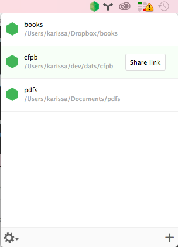

# Desktop Application for `dat`

This is a cross-platform desktop application for [dat](http://dat-data.com). PRs welcome.

Sharing a folder gives you a link. Give that link to someone else so they can download the data. Your data will be available as long as the app is running, traveling through no centralized servers. If the app is closed, the data will no longer be served.



## TODO

- [x] Create distribution tarball/.app
- [ ] tests
- [ ] windows 
- [ ] drag and drop to dat menu bar icon
- [ ] See info on each dat (e.g., number of peers)
- [ ] Write to a debug log which can be viewed from 'debug' option in settings
- [x] Prompt to start downloading when the user clicks a link starting with `dat://`

## Developer Install

This app under active development and not production ready. If you want to test it out, you can get it set up locally.

Easy to install and run:

```
node_modules $  git clone http://github.com/karissa/dat-app
node_modules $ cd dat-app
dat-app $ npm install
dat-app $ npm start
```
